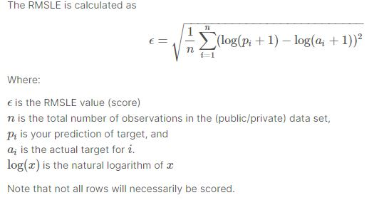

# Building-Energy-Consumption

This notebook aims to predict a building's energy consumption over 2017 and 2018 using the data from 2016 in 4 different consumpiton categories (electricity, chilled water, steam, hot water) using ASHRAE data, which is our problem statement as well. The datasets can be found on [Kaggle](https://www.kaggle.com/c/ashrae-energy-prediction).

The Train dataset provided is large dataset with 20 million rows along with supporting datasets of building_metadata, temperature. Using some **Memory Reduction techniques** i reduced the memory usage if train data till 40%.

To get the immediate summary of all features from building_metadata and temperature i have used **Pandas_Profiling library**.Also, to observe data more carefully Plotly library is used.

Project is divided in to two notebooks
1. [Understand, Clean, Format data and Exploratory Data Analysis](https://github.com/nehat280/Building-Energy-Consumption/blob/master/building_energy_consumption%20-PART%201(EDA).ipynb): 

     This notebook Consists of following parts:
     
     1. Reduce Memory Usage.
     
     2. Exploratory Data Analysis 
     
     3. Findings from EDA.
     
2. [Feature Engineering and Modelling](https://github.com/nehat280/Building-Energy-Consumption/blob/master/building_energy_consumption%20-PART%202(Feature%20Engineering).ipynb)
    
    1. Feature Engineering
    
    2. Creating Baseline Metrics
    
    3. Comparing Machine Learning Models 
    
        1. Linear Regression.
        
        2. Light GBM
    
    4. Performing Class Validation 
    
## Metric:

Metric used here is RSMLE(ROOT MEAN SQUARED LOG ERRROR)

## Findings from Data:

1. Energy consumption has different data ranges among meter categories and shows different distributions. Chilled water and hot_water time-series consumption shows seasonality. Hot water consumption increases in winter and chilled water consumption increases in summer. 

2. Electricty consumption has an increasing trend towards the end of 2016. There are no obvious patterns or seasonality effect in the steam consumption.

3. Primary use, site id, year built (or age), square feet has a significant effect in determining meter reading values which also intuitively makes sense. 

4. Some weather variables (air_temperature, dew_temperature, cloud_coverage) have high impact on meter reading values, some of them have slight (wind_direction, wind_speed) effect.

